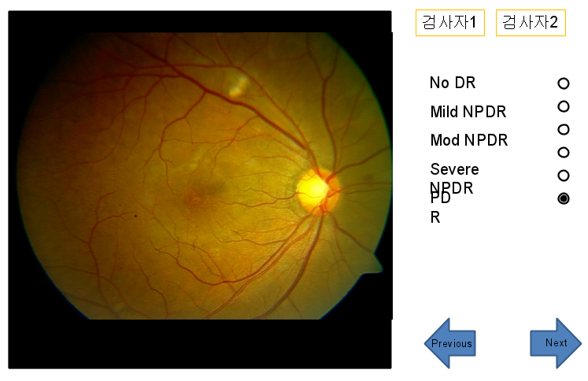

YoonProject1
====

# 릴리즈

- 2016-02-04 x86 테스트버전 
 - [YoonProject1-x86-2016-02-04.zip](releaseWithDate/YoonProject1-x86-2016-02-04.zip)

- 2016-01-19 테스트버전 
 - [YoonProject1-2016-01-19.zip](releaseWithDate/YoonProject1-2016-01-19.zip)

# 요구사항

## 검사자

- 검사자는 2명이다.
- 검사 수행 시에 자유롭게 검사자를 바꿀 수 있다.

## 검사판정

- 5가지판정값을 제공한다.

```
1. Normal DR
2. Mild NPDR
3. Mod NPDR
4. Severe NPDR
5. PDR
```

## UX

- Prev/Next 를 누르면 입력 사항 자동저장
- 한번 검사자 1/2를 정하면 다음 사진의 디폴트는 이전 입력 사항


## 이미지 로딩

- 검사자는 흑백/컬러 별로 구분된 디렉토리를 가지고 있다.
- 프로그램에서는 이미지가 포함되어 있는 디렉토리를 읽어 이미지 파일 리스트를
메모리에 들고 있어야 한다.

## 결과

- 포맷은 csv, 입력 디렉토리에 저장
- 한번 로딩에 하나의 csv 파일
- csv 파일에 row 추가되는 방식
- 프로토콜 예시

```
예를 들어 화일명이 

001_151126_101489851, 검사자1, mild NPDR인 경우 
001_151126_101489851와 검사자(1/2), mild NPDR을 저장함
(앞의 001_151126_는 무시)


10148985,1,1,2로 저장

가능하다면, 흑백/컬러 구별을 저장(어려우면 이건 포기) 이 경우 CSV
코드는 흑백은 0, 컬러는 1으로 해서, 흑백이라면, 

10148985,0,1,1,2의 데이터 저장
```

## 예시 화면



